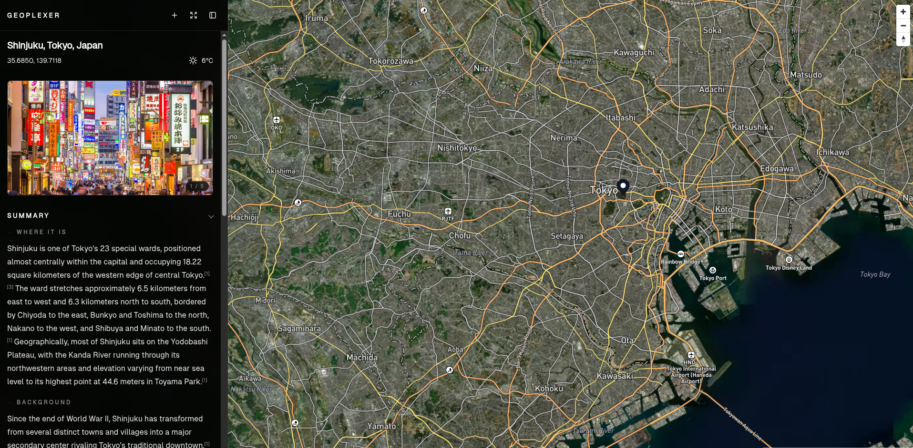

# Geoplexer

Globe exploration app powered by the Perplexity API, with local weather and nearby places recommendations. 



## Quick start (Docker)

1) Copy env files:

```bash
cp apps/api/.env.example apps/api/.env
cp apps/web/.env.example apps/web/.env
```

2) Fill in keys:

- `apps/api/.env`: `PERPLEXITY_API_KEY`, `SERPER_API_KEY`
- `apps/web/.env`: `VITE_MAPBOX_TOKEN`

3) Run:

```bash
docker compose up --build
```

4) Open:

- http://localhost:5173

## Local dev (no Docker)

API:

```bash
cd apps/api
bun install
bun run dev
```

Web:

```bash
cd apps/web
npm install
npm run dev
```

Open http://localhost:5173

## Notes

- `VITE_API_BASE_URL` is read when the Vite dev server starts. Restart the web container if you change it.
- Mapbox tokens are public in the browser; use your own token and restrict it to your domain(s).
- Perplexity and Serper keys are server-side only; keep them in `apps/api/.env`.

More details: `docs/LOCAL.md`
